# azure-sentinel-honeypot-lab

# Azure Honeypot & SIEM Attack Monitoring Lab

---

## Overview

This project demonstrates how I built a cloud-based honeypot using **Microsoft Azure** to simulate a vulnerable virtual machine exposed to the public internet.

The goal was to observe real-world attack attempts, collect security logs, forward them into a SIEM, and visualise attacker activity using a live attack map.

The system began receiving real malicious login attempts shortly after deployment.

Using **Microsoft Sentinel**, **Log Analytics Workspace**, **KQL**, and **Azure Watchlists**, I analysed failed login attempts and mapped attacker IP addresses geographically.

---

## Skills & Technologies

- Microsoft Azure
- Microsoft Sentinel (SIEM)
- Log Analytics Workspace
- Kusto Query Language (KQL)
- Windows Event Viewer
- Network Security Groups (NSGs)
- Windows Security Logs
- Cloud Security Monitoring
- Threat Detection & Analysis
- SOC-style investigation workflow

---

## Architecture

The environment consisted of:

- Azure Resource Group
- Virtual Network (VNet)
- Windows Virtual Machine
- Open Network Security Group (NSG)
- Log Analytics Workspace
- Microsoft Sentinel

📌 Architecture Diagram:

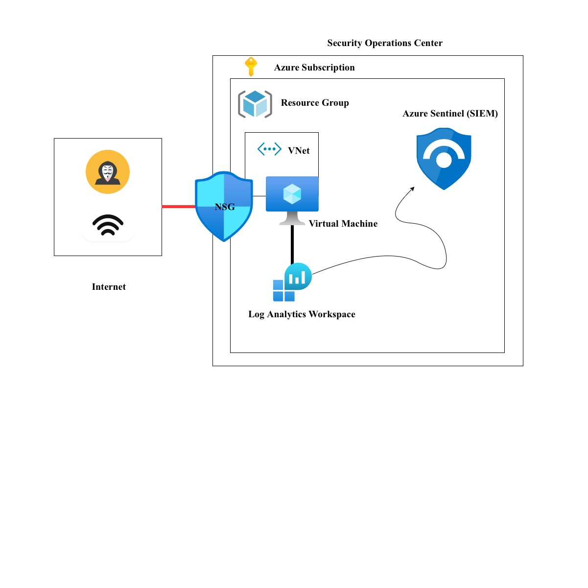   

---

## Project Objectives

- Deploy a vulnerable Windows VM in Azure
- Expose it to the public internet
- Capture failed login attempts
- Forward logs to a central repository
- Analyse logs using Microsoft Sentinel
- Query security events using KQL
- Map attacker locations globally

---

## Step 1 — Azure Environment Setup

I created a Resource Group in Azure and deployed the core infrastructure:

- Virtual Network (VNet)
- Subnet
- Windows Virtual Machine

The VM was assigned a public IP and connected to the network.

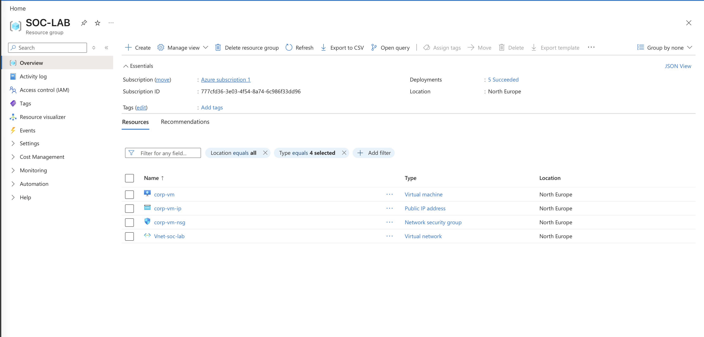

---

## Step 2 — Exposing the Virtual Machine

To simulate a real-world attack surface, I modified the **Network Security Group (NSG)** rules to allow all inbound traffic.

This made the VM fully exposed to the internet.

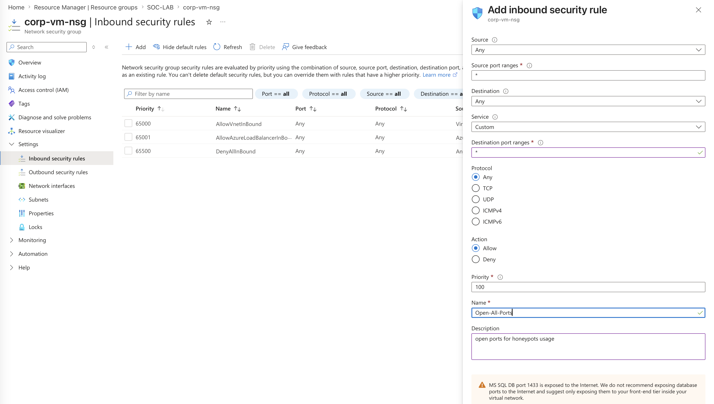

---

## Step 3 — Disabling Firewall

After connecting via Remote Desktop Protocol (RDP), I disabled Windows Defender Firewall to make the system fully permissive internally.

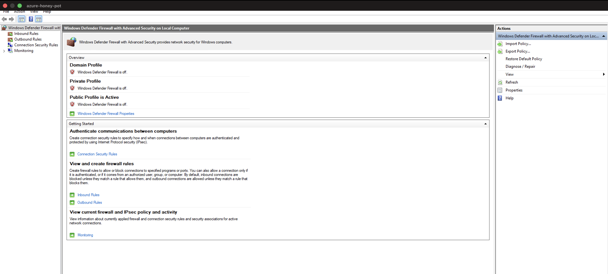

---

## Step 4 — Generating Failed Login Attempts

I intentionally triggered multiple failed login attempts using fake usernames.

These were recorded in:

**Windows Event Viewer → Security Logs**

Key Event ID:

- **4625 — Failed Logon Attempt**

These logs contained:
- Source IP addresses
- Username attempts
- Timestamp data
- Authentication failure details

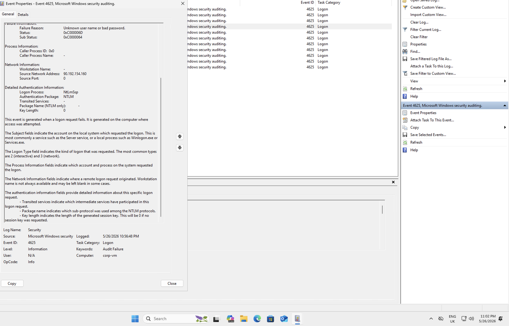

---

## Step 5 — Log Analytics Workspace

I created a **Log Analytics Workspace** to centralise all security logs from the virtual machine.

This acted as the log repository for the environment.

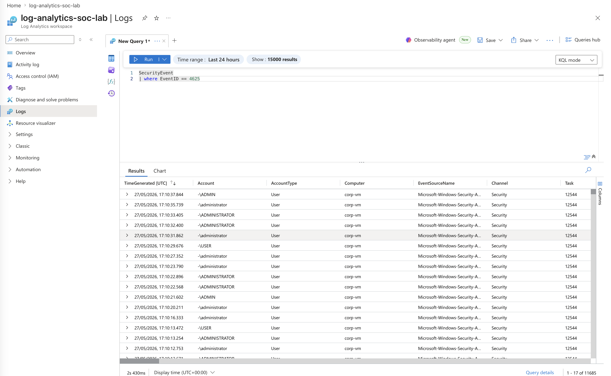

---

## Step 6 — Microsoft Sentinel Setup

I connected the Log Analytics Workspace to **Microsoft Sentinel** to enable SIEM functionality.

This allowed advanced querying, detection, and visualisation.

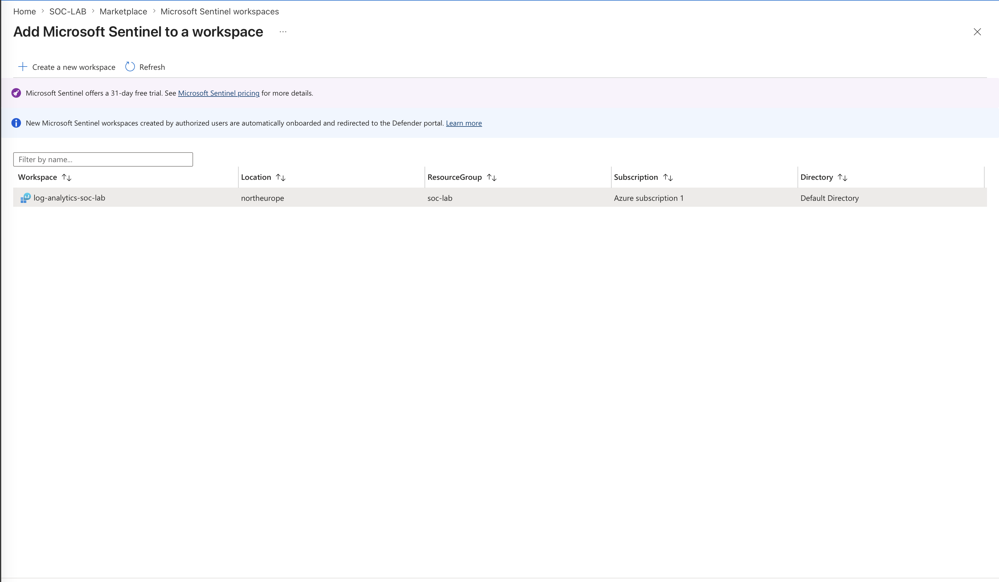

---

## Step 7 — Log Collection Configuration

I configured:

- Windows Security Events Connector
- Data Collection Rules (DCR)

This pipeline connected:

VM → Log Analytics Workspace → Microsoft Sentinel

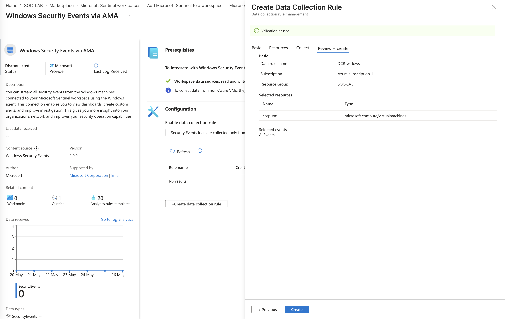

---

## Step 8 — KQL Log Analysis

I used **Kusto Query Language (KQL)** to analyse failed login attempts.

Example focus:
- Event ID 4625 (Failed Logon Attempts)

This revealed multiple brute-force attempts from external IP addresses.

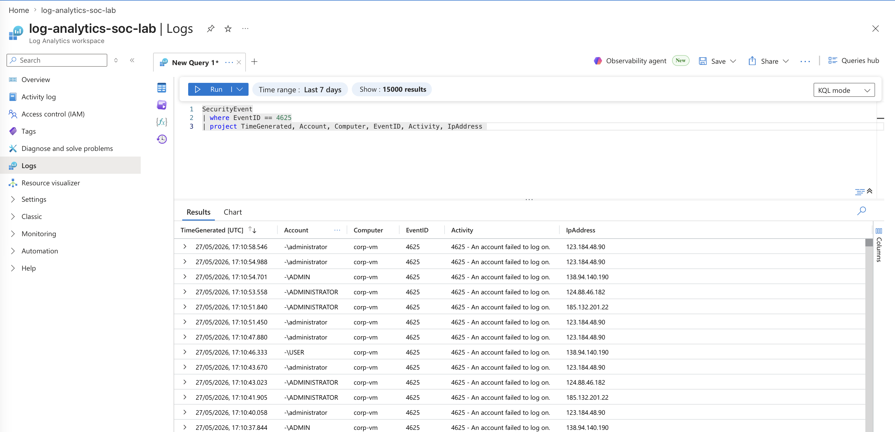

---

## Step 9 — Geolocation Mapping

Since logs only contained IP addresses, I imported an **Azure Sentinel Watchlist** containing IP-to-location mappings.

This allowed:

- IP address → Country / City mapping
- Latitude / Longitude resolution

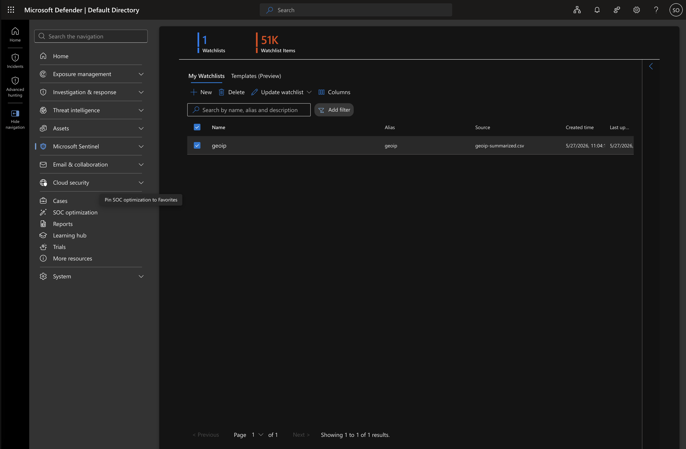

---

## Step 10 — Attack Map Dashboard

I created a **Microsoft Sentinel Workbook** to visualise attack activity globally.

This displayed real-time attacker locations on an interactive map.

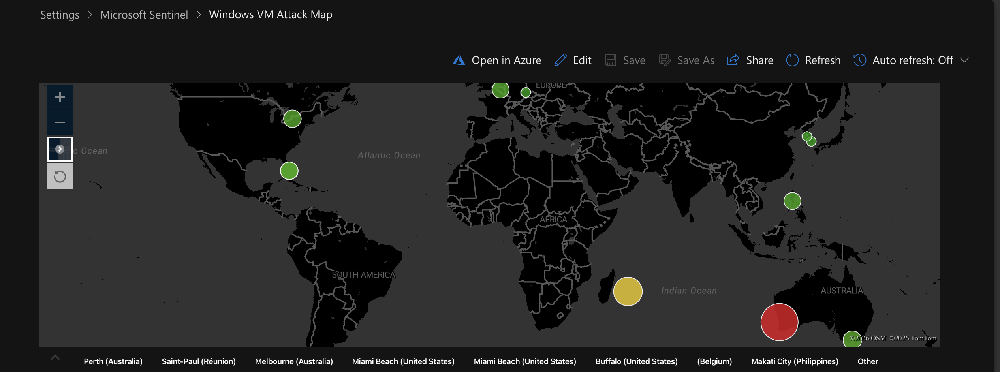

---

## Results Summary

| Location | Failed Attempts |
|----------|----------------|
| Perth, Australia | 6.47K |
| Saint-Paul, Réunion | 3.1K |
| Melbourne, Australia | 666 |
| Miami Beach, USA | 541 |
| Belgium | 457 |
| Makati City, Philippines | 455 |

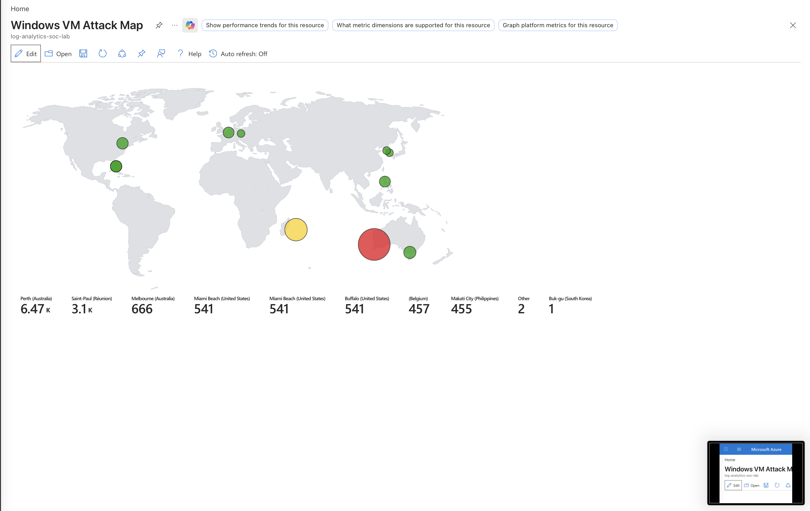

---

## Key Takeaways

This project demonstrated how quickly systems exposed to the internet begin receiving automated attack traffic.

It strengthened my understanding of:

- Cloud security monitoring
- SIEM operations (Microsoft Sentinel)
- KQL-based log analysis
- Threat detection workflows
- Security event correlation
- Attack surface exposure risks

---

## Conclusion

This lab provided hands-on experience building a real-world honeypot and analysing live attack traffic using Azure security tools.

It simulates how SOC teams monitor, detect, and visualise threats in a cloud environment.

